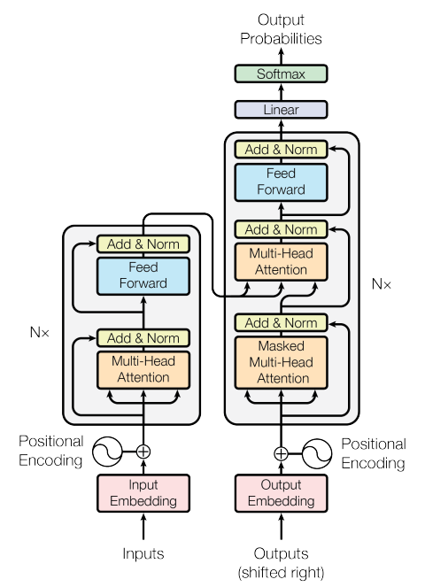

# LLM (Large Language Model)

LLM can do many stuff like what you have seen evolving of ChatBot nowaday. Here, I will focus on only Machine Translation that using LLM model just to let you see `How does it work` and you will understand `How does ChatGPT really do before answer our questions?`.

## History

1. ANN (Artificial Neural Network): Inspired by the human brain to predict the future output (e.g. pattern recognition, classification, regression).
2. DNN (Deep Neural Network): To improve quality of result from ANN some people are add more complexity by add more hidden layer to ANN to solve more complex problem e.g. image recognition, speech recognition.
3. RNN (Recurrent Neural Network): To improve quality of result from DNN to handle sequencial processing and add memory to model e.g. speech recognition, time series analysis.
4. TNN (Transformer Neural Network): To improve quality and performance from RNN. TNN can do parallel processing and give better result for many specific tasks e.g. machine translation, text summarization, question answering.
5. LLM (Large Language Model): That mostly use TNN to solve NLP (Natural Language Processing) problem to generate human-like text

## Background Understanding of Supervised Learning

To create Machine Learning Translation that can understand and predict something. We need to have 3 phase of working.
1. Training: When you need to teach someone that can translate english to thai, you need to teach them language grammar. While you teach them you also need to let them know this is right or wrong e.g. What is "My" translate in thai, if the model predict wrong, you need to tell the right answer then they will learn.
2. Evaluation: Once they done with learning, they need to take examination to test their knowledge. It will be the thing that they did not know before but need to based on the concept that thay learn (because we teach them to learn, not to memorize). This step they will not get the answer for right or wrong, we just keep tracking the result and say pass or fail.
3. Prediction: Once they pass the test (depends on us that will set the threshold of passing), we can let them use these knowledge to get a real job, do the real work. E.g. ChatBot.

<<<<<<< HEAD
**NOTE**: In Training phase can do behind the scene and we don't know `How long of this person have been learning`, similar to the person that already have experience in the field, in machine we called `pre-trained model`.
=======
**NOTE**: In Training phase can do behind the scene and we don't know `How long of this person have been learning`, similar to the person that already have experience in the field, in machine we called `pre-trained` model.
>>>>>>> 21b1725dff1b0e229278207bf5f645e4c39988bc

## How does it work?

<<<<<<< HEAD
Thats it! easy right?

...

...

...

Nah, I'm kidding :D

For me, that is not expert in this field, so far that I have read and search about it. I think explain in the way of "breaking it down" then "Putting it back togather" should get better understanding (at least for me ...). Let's start with highest level of explaination. In the way of translate the word or sentence, translate in sentence will be a lot harder because you need to understand the context of that sentence first.

======================

INPUT => PROCESS => OUTPUT

For input and output wil have token called End-of-sequence (EOS) to tell the model that when you found this token its mean the sequence is ended and please process next step.

- Input: Sentence between 2 language (I'll call `source` and `target`) e.g. ["I love cats.", "ฉันรักแมว"]
> asd
asd
asd 
asd

asdasd

PROCESS: PRE => TRANSFORMER => POST
PRE:
    - Inputs / Outputs
        - Text Corpus
        - Split to sentences
        - Clean sentences (e.g. stop word)
    - Input / Output Embedding (e.g. BPE)
    - Positional Encoding
POST:
    - Linear
    - Softmax
    - Output Probabilities
    - NOTE: Output from Encoder
TRANSFORMER:
    - 
=======
>>>>>>> 21b1725dff1b0e229278207bf5f645e4c39988bc
